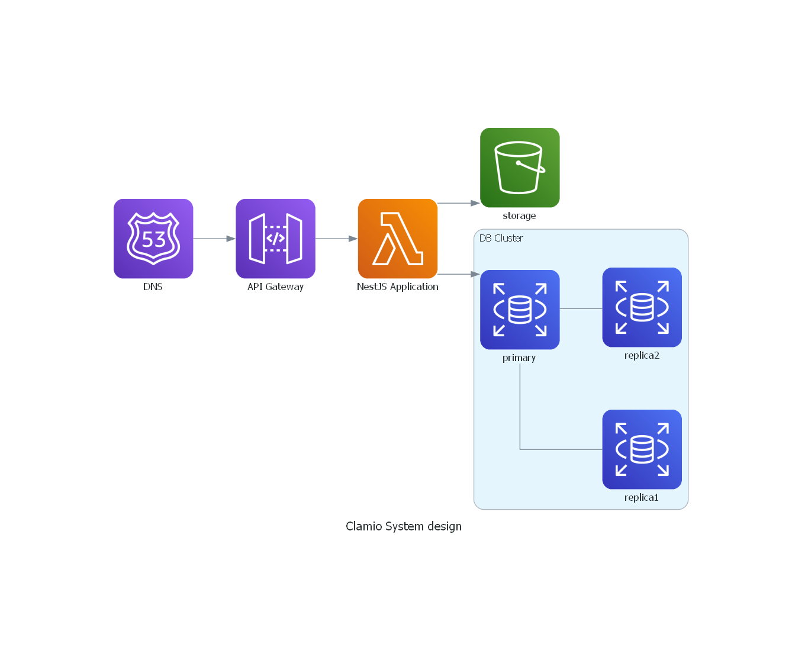

<p align="center">
    <a href="./system_design/clamioSystemDesign.py" target="_blank">
      
    </a>
    </a>
</p>


## Description

Clamio API using [Nest](https://github.com/nestjs/nest) framework in TypeScript.


## Installation

```bash
$ npm install
```

## Running the app

```bash
# development
$ npm run start

# watch mode
$ npm run start:dev

# production mode
$ npm run start:prod
```

## Deployment

```bash
# building the build folder called dist
$ npm run build

# offline deployment
$ npx serverless offline
```
